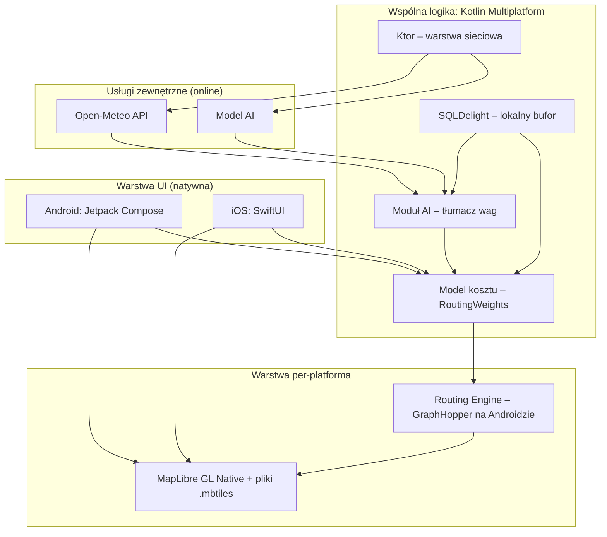
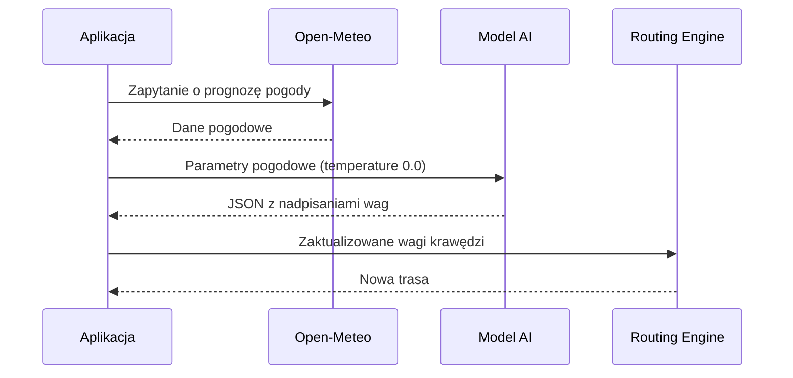
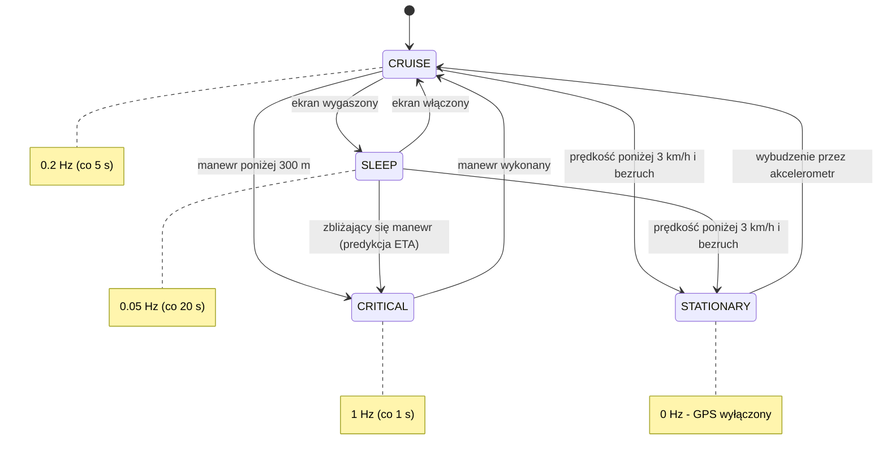
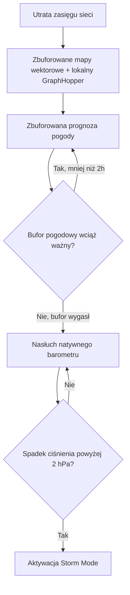

# ReactiveBike — Dokumentacja Techniczna Systemu
**Nawigacja Rowerowa Offline-First**

- **Wersja dokumentu:** 1.1
- **Data:** 26 lipca 2026
- **Status:** Specyfikacja systemu (draft)
- **Zakres:** Architektura, logika trasowania, moduł AI, zarządzanie baterią, tryb offline, prywatność

> **Zmiany w wersji 1.1.** Weryfikacja założeń wobec dokumentacji bibliotek wykazała trzy
> rozbieżności, skorygowane w sekcjach 3–5, 7 i 8. Uzasadnienia zapisano jako
> [ADR-y](adr/README.md); miejsca korekt są w tekście oznaczone odsyłaczami.

---

## Spis treści

1. Wprowadzenie
2. Założenia Systemu i Kluczowe Wyróżniki
3. Stos Technologiczny
4. Architektura Systemu — Widok Ogólny
5. Logika Trasowania (Routing Engine)
6. Moduł AI — Tłumacz Warunków Pogodowych na Wagi
7. Zarządzanie Baterią — GPS State Machine
8. Architektura Offline-First (Graceful Degradation)
9. Prywatność i Bezpieczeństwo Danych
10. Słownik Pojęć
11. Otwarte Kwestie i Dalsze Kroki

---

## 1. Wprowadzenie

Niniejszy dokument stanowi specyfikację techniczną aplikacji **ReactiveBike** — mobilnej nawigacji rowerowej zaprojektowanej w modelu *offline-first*. Opisuje architekturę systemu, logikę wyznaczania tras, mechanizm adaptacji do warunków pogodowych oparty o AI, strategię zarządzania energią urządzenia oraz zachowanie aplikacji przy utracie łączności sieciowej.

Odbiorcą dokumentu jest zespół deweloperski (Android / iOS) oraz osoby odpowiedzialne za decyzje architektoniczne i produktowe. Dokument bazuje na dostarczonej specyfikacji systemowej i rozszerza ją o strukturę, diagramy oraz doprecyzowanie kwestii prywatności.

## 2. Założenia Systemu i Kluczowe Wyróżniki

ReactiveBike odróżnia się od typowych aplikacji do nawigacji rowerowej czterema filarami:

| Wyróżnik | Opis |
|---|---|
| **Brak funkcji społecznościowych** | Świadoma decyzja produktowa — bez feedu, profili publicznych, udostępniania tras czy rankingów. |
| **Prywatność** | Minimalizacja danych opuszczających urządzenie — szczegóły w sekcji 9. |
| **Pełny tryb offline** | Aplikacja musi zachować pełną funkcjonalność w terenie bez zasięgu (lasy, góry). |
| **Inteligentne omijanie warunków** | Silnik AI + Cost Function dynamicznie modyfikują trasę na podstawie pogody i terenu. |

## 3. Stos Technologiczny

| Warstwa | Technologia | Rola w systemie |
|---|---|---|
| Architektura współdzielona | Kotlin Multiplatform (KMP) | Wspólna logika biznesowa dla Android i iOS przy zachowaniu natywnego UI |
| UI — Android | Jetpack Compose | Natywny interfejs użytkownika |
| UI — iOS | SwiftUI | Natywny interfejs użytkownika |
| Silnik mapy | MapLibre GL Native | Renderowanie map wektorowych, obsługa plików `.mbtiles` offline ([ADR-0003](adr/0003-offline-mbtiles.md)) |
| Silnik trasowania | GraphHopper (Android) | Wyznaczanie tras lokalnie, osadzony na urządzeniu. **Warstwa per-platforma, nie wspólna** — silnik dla iOS pozostaje otwarty ([ADR-0001](adr/0001-silnik-trasowania-per-platforma.md)) |
| Warstwa sieciowa | Ktor | Komunikacja z Open-Meteo i modelem AI |
| Baza danych | SQLDelight | Lokalny bufor map, tras i prognoz pogody |

> **Kluczowa decyzja architektoniczna:** silnik map i silnik trasowania działają w całości lokalnie na urządzeniu — to fundament trybu offline-first (sekcja 8) i jednocześnie jeden z filarów prywatności (sekcja 9).

> **Korekta 1.1.** GraphHopper jest biblioteką Javy i nie uruchomi się na iOS, więc silnik trasowania **nie jest kodem wspólnym KMP**. Warstwa wspólna posiada model kosztu jako dane (`RoutingWeights`), a wiązanie z silnikiem należy do warstwy natywnej. Pierwszą wydawaną platformą jest Android. Pełne uzasadnienie i odrzucone alternatywy: [ADR-0001](adr/0001-silnik-trasowania-per-platforma.md).

## 4. Architektura Systemu — Widok Ogólny

Poniższy diagram przedstawia relacje pomiędzy warstwą UI, wspólną logiką KMP, warstwą per-platforma (silnik trasowania i silnik mapy) oraz usługami zewnętrznymi.



Logika biznesowa — model kosztu, baza danych, warstwa sieciowa i moduł AI — jest współdzielona pomiędzy platformami dzięki KMP. Natywna jest warstwa prezentacji oraz, zgodnie z [ADR-0001](adr/0001-silnik-trasowania-per-platforma.md), samo wiązanie z silnikiem trasowania i silnikiem mapy. Granica jest wąska i jawna: warstwa wspólna oddaje wagi jako dane, warstwa natywna tłumaczy je na format swojego silnika. Usługi zewnętrzne (Open-Meteo, model AI) są jedynymi punktami systemu wymagającymi aktywnego połączenia sieciowego.

## 5. Logika Trasowania (Routing Engine)

Trasy są wyliczane **lokalnie** poprzez modyfikację wag krawędzi grafu OpenStreetMap wewnątrz silnika trasowania — na Androidzie jest nim GraphHopper, w którym mechanizmem nadpisywania wag w czasie działania są custom models.

Wzór kosztu i semantyka wag należą do warstwy wspólnej (`shared`, pakiet `routing`) i są niezależne od silnika; warstwa natywna tłumaczy je na format konkretnego silnika ([ADR-0001](adr/0001-silnik-trasowania-per-platforma.md)).

### 5.1 Wzór kosztu krawędzi

```
Koszt Krawędzi = Dystans * Waga Nawierzchni * Waga Infrastruktury * Topografia
```

### 5.2 Interpretacja modyfikatorów

Model wag jest **wyłącznie podwyższający**: waga neutralna to `1.0`, a preferencje wyrażamy przez karanie gorszych opcji, nie nagradzanie lepszych. Wymusza to GraphHopper — przy zmianie custom modelu w runtime z włączonym speedupem Landmarks wagi mogą być tylko podwyższane. Uzasadnienie: [ADR-0002](adr/0002-model-wag-tylko-podwyzszajacy.md).

| Zakres wartości | Znaczenie | Przykład zastosowania |
|---|---|---|
| `1.0` | Waga neutralna — segment bez modyfikacji | Droga bez szczególnych właściwości |
| `> 1.0` | Odstraszanie — segment mniej atrakcyjny, ale przejezdny | Nawierzchnia szutrowa na stromym podjeździe |
| `999.0` | Całkowity zakaz wjazdu | Błoto po ulewie (`999.0`) |
| `< 1.0` | **Wyłącznie jako wejście od modułu AI** — normalizowane do postaci podwyższającej przed przekazaniem silnikowi | Asfalt podczas deszczu (`0.5` → po normalizacji `1.0`) |

Wartość `999.0` jest **sentinelem**, nie liczbą: krawędź nią oznaczona jest wykluczana z trasowania, a nie traktowana jako bardzo droga. Gdyby wchodziła do wzoru jak zwykły mnożnik, algorytm poprowadziłby przez zakazany segment, o ile objazd okazałby się jeszcze droższy.

### 5.3 Przykład ilustracyjny

Poniższy przykład pokazuje, jak wagi zwrócone przez moduł AI (sekcja 6) trafiają do wzoru kosztu. Przy wykryciu ulewnego deszczu moduł AI zwraca: `mud = 999.0`, `asphalt = 0.5`, `cycleway = 0.5`.

Wagi poniżej `1.0` nie są odrzucane — aplikacja normalizuje je, skalując każdy wymiar tak, by jego minimum wynosiło `1.0`:

| Wymiar | Z modułu AI | Po normalizacji |
|---|---|---|
| nawierzchnia: `asphalt` | `0.5` | `1.0` |
| nawierzchnia: domyślna | `1.0` | `2.0` |
| nawierzchnia: `mud` | `999.0` | `999.0` (sentinel, nie skalowany) |
| infrastruktura: `cycleway` | `0.5` | `1.0` |
| infrastruktura: domyślna | `1.0` | `2.0` |

Krawędź leżąca na asfaltowej ścieżce rowerowej otrzyma mnożnik `1.0 × 1.0 = 1.0`, a krawędź domyślna o tej samej długości `2.0 × 2.0 = 4.0` (przy założeniu współczynnika topografii = 1.0, teren płaski). Ścieżka jest więc **czterokrotnie tańsza** od drogi domyślnej — dokładnie tyle, ile zapowiadał pierwotny zapis `0.5 × 0.5 = 0.25`. Skalowanie całego wymiaru przez tę samą stałą podnosi koszty wszystkich tras proporcjonalnie, więc trasa optymalna zostaje ta sama. Krawędź prowadząca przez błoto zostaje wykluczona (`999.0`).

Zgodność tego przykładu z kodem pilnuje test `po normalizacji asfaltowa sciezka jest czterokrotnie tansza od domyslnej` w `shared/src/commonTest/kotlin/pl/reactivebike/routing/EdgeCostTest.kt`.

## 6. Moduł AI — Tłumacz Warunków Pogodowych na Wagi

Moduł AI pełni ściśle zdefiniowaną, wąską rolę: jest **bezstanowym tłumaczem** parametrów pogodowych (z Open-Meteo) na wagi matematyczne zrozumiałe dla silnika trasowania. Nie podejmuje samodzielnych decyzji nawigacyjnych ani nie generuje swobodnego tekstu.

### 6.1 Wymagania konfiguracyjne

- `temperature: 0.0` — model musi działać deterministycznie, bez kreatywności ani wariancji odpowiedzi.
- Model zwraca **wyłącznie** poprawny JSON — bez dodatkowego tekstu, komentarzy czy formatowania wokół odpowiedzi.

### 6.2 Kontrakt wyjściowy (JSON)

```json
{
  "surface_overrides": { "mud": 999.0, "asphalt": 0.5 },
  "infrastructure_overrides": { "cycleway": 0.5 },
  "ui_notification": "Wykryto ulewę. Szukam asfaltu."
}
```

| Pole | Znaczenie |
|---|---|
| `surface_overrides` | Nadpisania wag dla typów nawierzchni (np. błoto, asfalt) |
| `infrastructure_overrides` | Nadpisania wag dla typów infrastruktury (np. ścieżka rowerowa) |
| `ui_notification` | Komunikat wyświetlany użytkownikowi, tłumaczący zmianę trasy |

### 6.3 Przepływ danych



### 6.4 Walidacja odpowiedzi i fallback

Odpowiedź modelu nigdy nie trafia wprost do silnika trasowania — przechodzi przez walidator (`shared/src/commonMain/kotlin/pl/reactivebike/weather/WeatherWeightsValidator.kt`), który egzekwuje kontrakt z sekcji 6.1:

| Sytuacja | Zachowanie |
|---|---|
| Poprawny JSON, wagi dodatnie i skończone | Przyjęty; wagi znormalizowane zgodnie z [ADR-0002](adr/0002-model-wag-tylko-podwyzszajacy.md) |
| Wagi `< 1.0` | Przyjęte i przeskalowane — nie są błędem |
| Tekst wokół JSON-a (np. `Oto wagi: {...}` albo opakowanie w blok markdown) | Odrzucony — sekcja 6.1 wymaga czystego JSON-a |
| JSON ucięty lub niepoprawny składniowo | Odrzucony |
| Waga zerowa, ujemna, `NaN` lub nieskończona | Odrzucona |
| Pusty klucz nawierzchni lub infrastruktury | Odrzucony |
| Brak odpowiedzi — puste ciało, timeout, błąd sieci | Odrzucony |
| Nieznane klucze w JSON-ie | Tolerowane, by dało się rozszerzać kontrakt bez psucia starszych klientów |

**Każdy wynik niesie gotowe do użycia wagi.** Przy odrzuceniu są to wagi domyślne, więc nawigacja jedzie dalej bez adaptacji do pogody, zamiast zatrzymać się na błędzie. To odpowiedź na dwie kwestie wskazane jako otwarte w pierwszej wersji dokumentu: strategię walidacji odpowiedzi modelu oraz zachowanie przy błędzie i timeoucie.

## 7. Zarządzanie Baterią — GPS State Machine

Częstotliwość odpytywania modułu GPS zmienia się dynamicznie w zależności od kontekstu jazdy, aby zminimalizować zużycie baterii.

| Stan | Warunek aktywacji | Częstotliwość | Interwał | Cel |
|---|---|---|---|---|
| **CRITICAL** | Manewr nawigacyjny w odległości < 300 m | 1 Hz | co 1 s | Maksymalna precyzja w newralgicznym momencie decyzji |
| **CRUISE** | Długi, prosty odcinek trasy | 0.2 Hz | co 5 s | Standardowe śledzenie pozycji przy niskim ryzyku zbłądzenia |
| **SLEEP** | Ekran urządzenia wygaszony | 0.05 Hz | co 20 s (wspomagane predykcją ETA) | Oszczędność baterii przy jeździe „w tle” |
| **STATIONARY** | Postój — prędkość < 3 km/h **oraz** brak ruchu z akcelerometru ([ADR-0004](adr/0004-warunek-wejscia-w-stan-stationary.md)) | 0 Hz | GPS wyłączony; wybudzenie przez akcelerometr | Zerowe zużycie GPS podczas przerw w jeździe |



> W stanie `SLEEP` rzadkie odczyty GPS są uzupełniane predykcją pozycji na bazie ETA, co pozwala zachować orientację co do zbliżającego się manewru mimo niskiej częstotliwości próbkowania. W stanie `STATIONARY` GPS jest całkowicie wyłączony, a wybudzenie systemu następuje w oparciu o ruch wykryty przez natywny akcelerometr — nie przez GPS.

### 7.1 Warunek postoju i pierwszeństwo reguł

Sam próg prędkości nie wystarcza do wejścia w `STATIONARY`. Rowerzysta na stromym podjeździe potrafi zejść poniżej 3 km/h, wciąż jadąc — wyłączenie GPS oznaczałoby wtedy oscylację `CRUISE` ↔ `STATIONARY` przez cały podjazd. Dlatego wejście w ten stan wymaga **jednocześnie** prędkości poniżej progu **i** braku ruchu z akcelerometru ([ADR-0004](adr/0004-warunek-wejscia-w-stan-stationary.md)).

Diagram nie rozstrzyga, co zrobić, gdy kilka warunków zachodzi naraz. Obowiązuje kolejność:

1. zbliżający się manewr → `CRITICAL` (bezpieczeństwo nawigacji przed oszczędnością baterii),
2. postój → `STATIONARY`,
3. stan ekranu rozstrzyga między `CRUISE` a `SLEEP`.

Ze stanu `CRITICAL` prowadzi jedno wyjście — do `CRUISE` po wykonaniu manewru. Dopóki manewr jest przed nami, precyzja pozycji ma pierwszeństwo przed oszczędzaniem baterii.

Maszyna jest zaimplementowana jako czysta funkcja przejścia w `shared/src/commonMain/kotlin/pl/reactivebike/gps/GpsStateMachine.kt` — bez zegara i bez dostępu do sprzętu, co pozwala pokryć testami każde przejście z powyższego diagramu.

## 8. Architektura Offline-First (Graceful Degradation)

Gdy urządzenie traci zasięg sieci komórkowej, system przechodzi przez zdefiniowaną sekwencję degradacji, zachowując maksimum funkcjonalności.



1. **Mapa i trasowanie** — aplikacja korzysta wyłącznie ze zbuforowanych map wektorowych (`.mbtiles`) oraz lokalnej instancji silnika trasowania — brak przerwy w nawigacji. MapLibre obsługuje pliki `.mbtiles` przez schemat `mbtiles://`, ale **jedno źródło w stylu mapy obsługuje dokładnie jeden plik**, a na Androidzie pliku nie można wskazać w `assets/` — musi zostać skopiowany do pamięci wewnętrznej. Konsekwencje dla pobierania wielu regionów opisuje [ADR-0003](adr/0003-offline-mbtiles.md).
2. **Pogoda (do 2h)** — zamiast zapytań do API wykorzystywana jest ostatnia zbuforowana prognoza pogody, ważna przez 2 godziny od utraty sieci.
3. **Po wygaśnięciu bufora — Storm Mode** — aplikacja nasłuchuje natywnego barometru urządzenia. Gwałtowny spadek ciśnienia (> 2 hPa) aktywuje tryb ucieczki przed burzą, który — zgodnie z logiką z sekcji 5 — podnosi wagi odstraszające dla otwartego terenu i nawierzchni podatnych na rozmoknięcie.

## 9. Prywatność i Bezpieczeństwo Danych

Prywatność jest jednym z czterech głównych wyróżników systemu (sekcja 2). Poniżej zebrano implikacje architektury opisanej w sekcjach 3–8 z perspektywy ochrony danych użytkownika oraz kwestie wymagające dalszego doprecyzowania.

### 9.1 Co architektura zapewnia już dziś

- **Trasowanie lokalne** — GraphHopper działa on-device, więc obliczenia trasy nie wymagają wysyłania lokalizacji użytkownika na serwer.
- **Brak warstwy społecznościowej** — brak kont publicznych, udostępniania tras czy telemetrii porównawczej między użytkownikami eliminuje całą klasę ryzyk związanych z prywatnością lokalizacji.
- **Lokalny bufor danych** — SQLDelight przechowuje mapy, trasy i prognozy pogody na urządzeniu, nie w chmurze.
- **Ograniczony zakres komunikacji sieciowej** — jedyne zewnętrzne wywołania to Open-Meteo (pogoda) i model AI (tłumaczenie wag) — brak stałego trackingu pozycji wysyłanego w tle na serwer.

### 9.2 Do doprecyzowania

- Dokładny zakres danych (same współrzędne vs. historia trasy) wysyłanych do Open-Meteo i modelu AI oraz to, czy zapytania są anonimizowane / pozbawione identyfikatorów użytkownika.
- Polityka retencji lokalnego bufora (SQLDelight) — czy i kiedy stare trasy/prognozy są czyszczone z urządzenia.
- Wymuszenie szyfrowanej transmisji (TLS) w warstwie Ktor dla wszystkich połączeń zewnętrznych.

## 10. Słownik Pojęć

| Termin | Wyjaśnienie |
|---|---|
| **KMP** | Kotlin Multiplatform — technologia współdzielenia kodu między Android i iOS |
| **`.mbtiles`** | Format pliku przechowującego kafelki map wektorowych do użytku offline |
| **Cost Function** | Funkcja licząca „koszt” przejazdu krawędzią grafu drogowego, używana przy wyznaczaniu trasy |
| **Hz (herc)** | Częstotliwość odpytywania GPS — liczba odczytów pozycji na sekundę |
| **hPa** | Hektopaskal — jednostka ciśnienia atmosferycznego, używana do detekcji nadchodzącej burzy |
| **ETA** | Estimated Time of Arrival — przewidywany czas dotarcia do celu lub kolejnego punktu |
| **Storm Mode** | Tryb aktywowany po wykryciu gwałtownego spadku ciśnienia, zmieniający priorytety trasowania w celu unikania burzy |

## 11. Otwarte Kwestie i Dalsze Kroki

### 11.1 Rozstrzygnięte w wersji 1.1

| Kwestia | Rozstrzygnięcie |
|---|---|
| Strategia walidacji odpowiedzi modelu AI | Sekcja 6.4 — ścisła walidacja z normalizacją wag, pokryta testami |
| Zachowanie przy błędzie/timeoucie zapytania do modelu AI | Sekcja 6.4 — fallback na wagi domyślne, nawigacja jedzie dalej |
| Utrzymanie i wersjonowanie dokumentu | Decyzje architektoniczne trafiają do [ADR-ów](adr/README.md); dokument dostaje odsyłacze zamiast przepisywania historii |

### 11.2 Wciąż otwarte

- **Silnik trasowania dla iOS.** [ADR-0001](adr/0001-silnik-trasowania-per-platforma.md) rozstrzyga Androida i odkłada iOS. Najpoważniejszym kandydatem jest Valhalla, wymaga jednak własnych artefaktów mobilnych i rozwiązania kwestii runtime'owych mnożników wag.
- **Pomiar kosztu speedupu Landmarks.** Jeśli wyznaczanie trasy bez LM okaże się dostatecznie szybkie na realnych dystansach rowerowych, ograniczenie z [ADR-0002](adr/0002-model-wag-tylko-podwyzszajacy.md) można znieść, a model wag uprościć.
- **Proces aktualizacji lokalnych map `.mbtiles`** — częstotliwość, rozmiar pobrań, wersjonowanie danych OSM. [ADR-0003](adr/0003-offline-mbtiles.md) ustala podział „jeden region = jeden plik", ale nie opisuje cyklu aktualizacji.
- **Próg czułości akcelerometru** dla wykrywania bezruchu ([ADR-0004](adr/0004-warunek-wejscia-w-stan-stationary.md)) — do ustalenia przy implementacji natywnej, wraz z zachowaniem przy roweru stojącym na wietrze.
- **Zakres danych przesyłanych do usług zewnętrznych** (sekcja 9.2) — nierozstrzygnięty.
- **Testy porównawcze tras** między platformami, gdy powstanie drugi silnik trasowania — konsekwencja [ADR-0001](adr/0001-silnik-trasowania-per-platforma.md).

---

*Dokument bazuje na specyfikacji systemowej ReactiveBike i został rozszerzony o strukturę, diagramy oraz sekcję prywatności w celu ułatwienia wdrożenia zespołowi deweloperskiemu. Wersja 1.1 koryguje założenia sekcji 3–5, 7 i 8 po weryfikacji wobec dokumentacji GraphHoppera i MapLibre — uzasadnienia w [ADR-ach](adr/README.md).*
