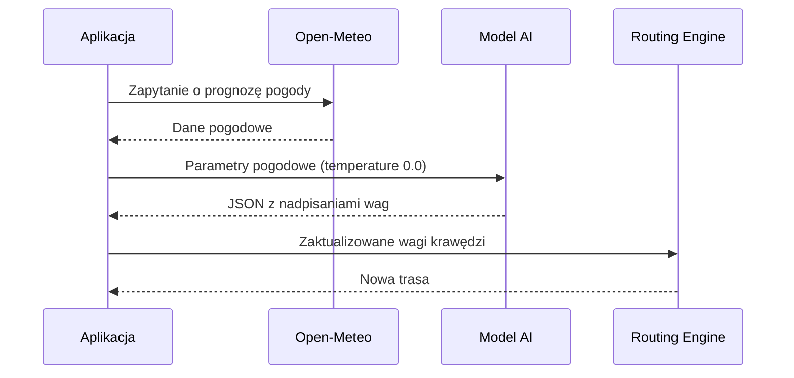
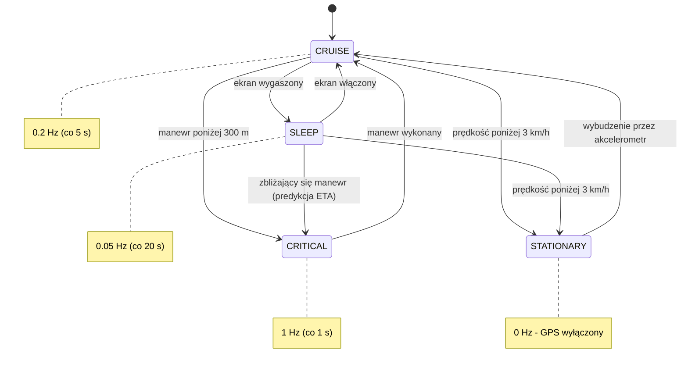
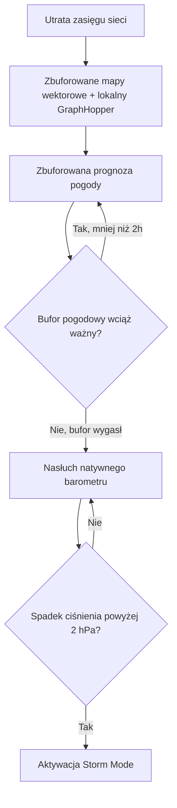

# ReactiveBike — Dokumentacja Techniczna Systemu
**Nawigacja Rowerowa Offline-First**

- **Wersja dokumentu:** 1.0
- **Data:** 26 lipca 2026
- **Status:** Specyfikacja systemu (draft)
- **Zakres:** Architektura, logika trasowania, moduł AI, zarządzanie baterią, tryb offline, prywatność

---

## Spis treści

1. Wprowadzenie
2. Założenia Systemu i Kluczowe Wyróżniki
3. Stos Technologiczny
4. Architektura Systemu — Widok Ogólny
5. Logika Trasowania (Routing Engine)
6. Moduł AI — Tłumacz Warunków Pogodowych na Wagi
7. Zarządzanie Baterią — GPS State Machine
8. Architektura Offline-First (Graceful Degradation)
9. Prywatność i Bezpieczeństwo Danych
10. Słownik Pojęć
11. Otwarte Kwestie i Dalsze Kroki

---

## 1. Wprowadzenie

Niniejszy dokument stanowi specyfikację techniczną aplikacji **ReactiveBike** — mobilnej nawigacji rowerowej zaprojektowanej w modelu *offline-first*. Opisuje architekturę systemu, logikę wyznaczania tras, mechanizm adaptacji do warunków pogodowych oparty o AI, strategię zarządzania energią urządzenia oraz zachowanie aplikacji przy utracie łączności sieciowej.

Odbiorcą dokumentu jest zespół deweloperski (Android / iOS) oraz osoby odpowiedzialne za decyzje architektoniczne i produktowe. Dokument bazuje na dostarczonej specyfikacji systemowej i rozszerza ją o strukturę, diagramy oraz doprecyzowanie kwestii prywatności.

## 2. Założenia Systemu i Kluczowe Wyróżniki

ReactiveBike odróżnia się od typowych aplikacji do nawigacji rowerowej czterema filarami:

| Wyróżnik | Opis |
|---|---|
| **Brak funkcji społecznościowych** | Świadoma decyzja produktowa — bez feedu, profili publicznych, udostępniania tras czy rankingów. |
| **Prywatność** | Minimalizacja danych opuszczających urządzenie — szczegóły w sekcji 9. |
| **Pełny tryb offline** | Aplikacja musi zachować pełną funkcjonalność w terenie bez zasięgu (lasy, góry). |
| **Inteligentne omijanie warunków** | Silnik AI + Cost Function dynamicznie modyfikują trasę na podstawie pogody i terenu. |

## 3. Stos Technologiczny

| Warstwa | Technologia | Rola w systemie |
|---|---|---|
| Architektura współdzielona | Kotlin Multiplatform (KMP) | Wspólna logika biznesowa dla Android i iOS przy zachowaniu natywnego UI |
| UI — Android | Jetpack Compose | Natywny interfejs użytkownika |
| UI — iOS | SwiftUI | Natywny interfejs użytkownika |
| Silnik mapy | MapLibre GL Native | Renderowanie map wektorowych, obsługa plików `.mbtiles` offline |
| Silnik trasowania | GraphHopper | Wyznaczanie tras lokalnie, osadzony na urządzeniu |
| Warstwa sieciowa | Ktor | Komunikacja z Open-Meteo i modelem AI |
| Baza danych | SQLDelight | Lokalny bufor map, tras i prognoz pogody |

> **Kluczowa decyzja architektoniczna:** silnik map i silnik trasowania działają w całości lokalnie na urządzeniu — to fundament trybu offline-first (sekcja 8) i jednocześnie jeden z filarów prywatności (sekcja 9).

## 4. Architektura Systemu — Widok Ogólny

Poniższy diagram przedstawia relacje pomiędzy warstwą UI, wspólną logiką KMP, silnikiem map oraz usługami zewnętrznymi.

```mermaid
graph TD
    subgraph UI["Warstwa UI (natywna)"]
        A1[Android: Jetpack Compose]
        A2[iOS: SwiftUI]
    end
    subgraph KMP["Wspólna logika: Kotlin Multiplatform"]
        B1[Routing Engine – GraphHopper]
        B4[Moduł AI – tłumacz wag]
        B2[SQLDelight – lokalny bufor]
        B3[Ktor – warstwa sieciowa]
    end
    subgraph MAP["Silnik mapy"]
        C1[MapLibre GL Native + pliki .mbtiles]
    end
    subgraph EXT["Usługi zewnętrzne (online)"]
        D1[Open-Meteo API]
        D2[Model AI]
    end

    A1 --> B1
    A2 --> B1
    A1 --> C1
    A2 --> C1
    B1 --> C1
    B4 --> B1
    B3 --> D1
    B3 --> D2
    D1 --> B4
    D2 --> B4
    B2 --> B1
    B2 --> B4
```



Cała logika biznesowa (trasowanie, baza danych, sieć, moduł AI) jest współdzielona pomiędzy platformami dzięki KMP — natywna jest wyłącznie warstwa prezentacji. Usługi zewnętrzne (Open-Meteo, model AI) są jedynymi punktami systemu wymagającymi aktywnego połączenia sieciowego.

## 5. Logika Trasowania (Routing Engine)

Trasy są wyliczane **lokalnie** poprzez modyfikację wag krawędzi grafu OpenStreetMap wewnątrz silnika GraphHopper.

### 5.1 Wzór kosztu krawędzi

```
Koszt Krawędzi = Dystans * Waga Nawierzchni * Waga Infrastruktury * Topografia
```

### 5.2 Interpretacja modyfikatorów

| Zakres wartości | Znaczenie | Przykład zastosowania |
|---|---|---|
| `< 1.0` | Przyciąganie — segment preferowany | Asfalt podczas deszczu (`0.5`) |
| `> 1.0` | Odstraszanie — segment mniej atrakcyjny, ale przejezdny | Nawierzchnia szutrowa na stromym podjeździe |
| `999.0` | Całkowity zakaz wjazdu | Błoto po ulewie (`999.0`) |

### 5.3 Przykład ilustracyjny

Poniższy przykład pokazuje, jak wagi zwrócone przez moduł AI (sekcja 6) trafiają bezpośrednio do wzoru kosztu. Przy wykryciu ulewnego deszczu moduł AI zwraca: `mud = 999.0`, `asphalt = 0.5`, `cycleway = 0.5`.

Krawędź grafu leżąca na asfaltowej ścieżce rowerowej otrzyma mnożnik `0.5 × 0.5 = 0.25` (przy założeniu współczynnika topografii = 1.0, teren płaski) — jej efektywny koszt spadnie czterokrotnie względem dystansu bazowego, co silnie premiuje ten wybór w algorytmie wyznaczania trasy. Krawędź prowadząca przez błoto zostanie efektywnie wykluczona (`999.0`).

## 6. Moduł AI — Tłumacz Warunków Pogodowych na Wagi

Moduł AI pełni ściśle zdefiniowaną, wąską rolę: jest **bezstanowym tłumaczem** parametrów pogodowych (z Open-Meteo) na wagi matematyczne zrozumiałe dla silnika trasowania. Nie podejmuje samodzielnych decyzji nawigacyjnych ani nie generuje swobodnego tekstu.

### 6.1 Wymagania konfiguracyjne

- `temperature: 0.0` — model musi działać deterministycznie, bez kreatywności ani wariancji odpowiedzi.
- Model zwraca **wyłącznie** poprawny JSON — bez dodatkowego tekstu, komentarzy czy formatowania wokół odpowiedzi.

### 6.2 Kontrakt wyjściowy (JSON)

```json
{
  "surface_overrides": { "mud": 999.0, "asphalt": 0.5 },
  "infrastructure_overrides": { "cycleway": 0.5 },
  "ui_notification": "Wykryto ulewę. Szukam asfaltu."
}
```

| Pole | Znaczenie |
|---|---|
| `surface_overrides` | Nadpisania wag dla typów nawierzchni (np. błoto, asfalt) |
| `infrastructure_overrides` | Nadpisania wag dla typów infrastruktury (np. ścieżka rowerowa) |
| `ui_notification` | Komunikat wyświetlany użytkownikowi, tłumaczący zmianę trasy |

### 6.3 Przepływ danych



## 7. Zarządzanie Baterią — GPS State Machine

Częstotliwość odpytywania modułu GPS zmienia się dynamicznie w zależności od kontekstu jazdy, aby zminimalizować zużycie baterii.

| Stan | Warunek aktywacji | Częstotliwość | Interwał | Cel |
|---|---|---|---|---|
| **CRITICAL** | Manewr nawigacyjny w odległości < 300 m | 1 Hz | co 1 s | Maksymalna precyzja w newralgicznym momencie decyzji |
| **CRUISE** | Długi, prosty odcinek trasy | 0.2 Hz | co 5 s | Standardowe śledzenie pozycji przy niskim ryzyku zbłądzenia |
| **SLEEP** | Ekran urządzenia wygaszony | 0.05 Hz | co 20 s (wspomagane predykcją ETA) | Oszczędność baterii przy jeździe „w tle” |
| **STATIONARY** | Postój — prędkość < 3 km/h | 0 Hz | GPS wyłączony; wybudzenie przez akcelerometr | Zerowe zużycie GPS podczas przerw w jeździe |



> W stanie `SLEEP` rzadkie odczyty GPS są uzupełniane predykcją pozycji na bazie ETA, co pozwala zachować orientację co do zbliżającego się manewru mimo niskiej częstotliwości próbkowania. W stanie `STATIONARY` GPS jest całkowicie wyłączony, a wybudzenie systemu następuje w oparciu o ruch wykryty przez natywny akcelerometr — nie przez GPS.

## 8. Architektura Offline-First (Graceful Degradation)

Gdy urządzenie traci zasięg sieci komórkowej, system przechodzi przez zdefiniowaną sekwencję degradacji, zachowując maksimum funkcjonalności.



1. **Mapa i trasowanie** — aplikacja korzysta wyłącznie ze zbuforowanych map wektorowych (`.mbtiles`) oraz lokalnej instancji GraphHoppera — brak przerwy w nawigacji.
2. **Pogoda (do 2h)** — zamiast zapytań do API wykorzystywana jest ostatnia zbuforowana prognoza pogody, ważna przez 2 godziny od utraty sieci.
3. **Po wygaśnięciu bufora — Storm Mode** — aplikacja nasłuchuje natywnego barometru urządzenia. Gwałtowny spadek ciśnienia (> 2 hPa) aktywuje tryb ucieczki przed burzą, który — zgodnie z logiką z sekcji 5 — podnosi wagi odstraszające dla otwartego terenu i nawierzchni podatnych na rozmoknięcie.

## 9. Prywatność i Bezpieczeństwo Danych

Prywatność jest jednym z czterech głównych wyróżników systemu (sekcja 2). Poniżej zebrano implikacje architektury opisanej w sekcjach 3–8 z perspektywy ochrony danych użytkownika oraz kwestie wymagające dalszego doprecyzowania.

### 9.1 Co architektura zapewnia już dziś

- **Trasowanie lokalne** — GraphHopper działa on-device, więc obliczenia trasy nie wymagają wysyłania lokalizacji użytkownika na serwer.
- **Brak warstwy społecznościowej** — brak kont publicznych, udostępniania tras czy telemetrii porównawczej między użytkownikami eliminuje całą klasę ryzyk związanych z prywatnością lokalizacji.
- **Lokalny bufor danych** — SQLDelight przechowuje mapy, trasy i prognozy pogody na urządzeniu, nie w chmurze.
- **Ograniczony zakres komunikacji sieciowej** — jedyne zewnętrzne wywołania to Open-Meteo (pogoda) i model AI (tłumaczenie wag) — brak stałego trackingu pozycji wysyłanego w tle na serwer.

### 9.2 Do doprecyzowania

- Dokładny zakres danych (same współrzędne vs. historia trasy) wysyłanych do Open-Meteo i modelu AI oraz to, czy zapytania są anonimizowane / pozbawione identyfikatorów użytkownika.
- Polityka retencji lokalnego bufora (SQLDelight) — czy i kiedy stare trasy/prognozy są czyszczone z urządzenia.
- Wymuszenie szyfrowanej transmisji (TLS) w warstwie Ktor dla wszystkich połączeń zewnętrznych.

## 10. Słownik Pojęć

| Termin | Wyjaśnienie |
|---|---|
| **KMP** | Kotlin Multiplatform — technologia współdzielenia kodu między Android i iOS |
| **`.mbtiles`** | Format pliku przechowującego kafelki map wektorowych do użytku offline |
| **Cost Function** | Funkcja licząca „koszt” przejazdu krawędzią grafu drogowego, używana przy wyznaczaniu trasy |
| **Hz (herc)** | Częstotliwość odpytywania GPS — liczba odczytów pozycji na sekundę |
| **hPa** | Hektopaskal — jednostka ciśnienia atmosferycznego, używana do detekcji nadchodzącej burzy |
| **ETA** | Estimated Time of Arrival — przewidywany czas dotarcia do celu lub kolejnego punktu |
| **Storm Mode** | Tryb aktywowany po wykryciu gwałtownego spadku ciśnienia, zmieniający priorytety trasowania w celu unikania burzy |

## 11. Otwarte Kwestie i Dalsze Kroki

- Doprecyzowanie zakresu danych przesyłanych do usług zewnętrznych (sekcja 9.2).
- Strategia walidacji odpowiedzi modelu AI (schemat JSON, obsługa błędnej lub niekompletnej odpowiedzi).
- Zachowanie systemu przy błędzie/timeout zapytania do modelu AI w trybie online (fallback na wagi domyślne?).
- Proces aktualizacji lokalnych map `.mbtiles` (częstotliwość, rozmiar pobrań, wersjonowanie danych OSM).
- Utrzymanie i wersjonowanie niniejszego dokumentu wraz z rozwojem projektu.

---

*Dokument bazuje na specyfikacji systemowej ReactiveBike i został rozszerzony o strukturę, diagramy oraz sekcję prywatności w celu ułatwienia wdrożenia zespołowi deweloperskiemu.*
