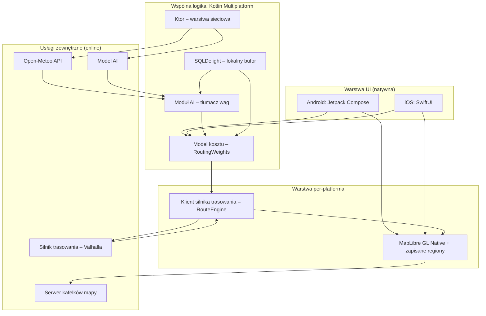
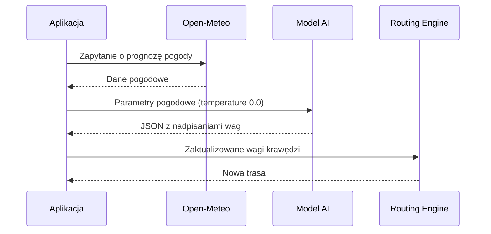
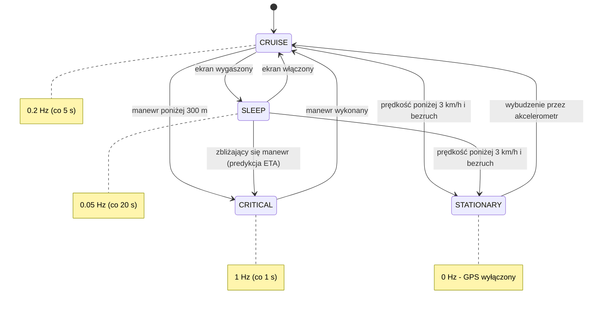
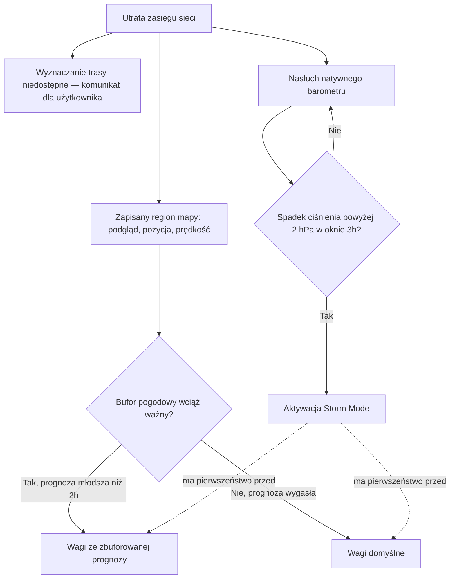

# ReactiveBike — Dokumentacja Techniczna Systemu
**Nawigacja Rowerowa Online z Zapisywanymi Regionami Mapy**
*(do wersji 1.2: „Nawigacja Rowerowa Offline-First” — patrz [ADR-0007](adr/0007-aplikacja-online-z-zapisanymi-regionami.md))*

- **Wersja dokumentu:** 2.1
- **Data:** 26 lipca 2026
- **Status:** Specyfikacja systemu (draft)
- **Zakres:** Architektura, logika trasowania, moduł AI, zarządzanie baterią, tryb offline, prywatność

> **Zmiany w wersji 1.1.** Weryfikacja założeń wobec dokumentacji bibliotek wykazała trzy
> rozbieżności, skorygowane w sekcjach 3–5, 7 i 8. Uzasadnienia zapisano jako
> [ADR-y](adr/README.md); miejsca korekt są w tekście oznaczone odsyłaczami.
>
> **Zmiany w wersji 1.2.** Doprecyzowano sekcję 8: ważność bufora pogodowego liczona jest
> od wydania prognozy, a barometr nasłuchiwany jest równolegle z buforem, nie po jego
> wygaśnięciu ([ADR-0005](adr/0005-barometr-nasluchiwany-rownolegle.md)).
>
> **Zmiany w wersji 2.1.** Trasa powstaje z planu przejazdu z punktami pośrednimi, wskazywanymi
> na mapie albo przez wyszukiwanie tekstowe (sekcja 5.0). Doszły dane postępu z szacowanym
> czasem dojazdu (5.0.2). Nawigacja ma jawny początek i koniec (5.0.1), dzięki czemu
> najkosztowniejszy tryb GPS włącza się dopiero w trakcie jazdy. Sekcja 9 odnotowuje, że zapytania wyszukiwarki także opuszczają urządzenie.
>
> **Zmiany w wersji 2.0 — zmiana kierunku produktu.** ReactiveBike jest **aplikacją online**.
> Wyznaczanie trasy wymaga sieci; tryb offline zawęża się do zapisanych regionów mapy.
> Oznacza to rezygnację z jednego z czterech filarów z sekcji 2 i wpływa na sekcje 5, 8 i 9.
> Uzasadnienie i koszty: [ADR-0007](adr/0007-aplikacja-online-z-zapisanymi-regionami.md).

---

## Spis treści

1. Wprowadzenie
2. Założenia Systemu i Kluczowe Wyróżniki
3. Stos Technologiczny
4. Architektura Systemu — Widok Ogólny
5. Logika Trasowania (Routing Engine)
6. Moduł AI — Tłumacz Warunków Pogodowych na Wagi
7. Zarządzanie Baterią — GPS State Machine
8. Zachowanie bez zasięgu (Graceful Degradation)
9. Prywatność i Bezpieczeństwo Danych
10. Słownik Pojęć
11. Otwarte Kwestie i Dalsze Kroki

---

## 1. Wprowadzenie

Niniejszy dokument stanowi specyfikację techniczną aplikacji **ReactiveBike** — mobilnej nawigacji rowerowej działającej **w modelu online**, z możliwością zapisania regionów mapy do użytku bez zasięgu. Opisuje architekturę systemu, logikę wyznaczania tras, mechanizm adaptacji do warunków pogodowych oparty o AI, strategię zarządzania energią urządzenia oraz zachowanie aplikacji przy utracie łączności sieciowej.

Odbiorcą dokumentu jest zespół deweloperski (Android / iOS) oraz osoby odpowiedzialne za decyzje architektoniczne i produktowe. Dokument bazuje na dostarczonej specyfikacji systemowej i rozszerza ją o strukturę, diagramy oraz doprecyzowanie kwestii prywatności.

## 2. Założenia Systemu i Kluczowe Wyróżniki

ReactiveBike odróżnia się od typowych aplikacji do nawigacji rowerowej trzema filarami.
Czwarty — pełny tryb offline — został wycofany w wersji 2.0 dokumentu; powód opisuje
[ADR-0007](adr/0007-aplikacja-online-z-zapisanymi-regionami.md), a jego ślad zostawiono
w tabeli, żeby nie zgubić informacji o tym, czym produkt miał być:

| Wyróżnik | Opis |
|---|---|
| **Brak funkcji społecznościowych** | Świadoma decyzja produktowa — bez feedu, profili publicznych, udostępniania tras czy rankingów. |
| **Prywatność** | Minimalizacja danych opuszczających urządzenie — szczegóły w sekcji 9. |
| **~~Pełny tryb offline~~** | **Wycofany w wersji 2.0.** Wyznaczanie trasy wymaga sieci. Bez zasięgu działa mapa z zapisanego regionu, pozycja, prędkość, ciśnienie i Storm Mode — ale nie nawigacja ([ADR-0007](adr/0007-aplikacja-online-z-zapisanymi-regionami.md)). |
| **Inteligentne omijanie warunków** | Silnik AI + Cost Function dynamicznie modyfikują trasę na podstawie pogody i terenu. |

## 3. Stos Technologiczny

| Warstwa | Technologia | Rola w systemie |
|---|---|---|
| Architektura współdzielona | Kotlin Multiplatform (KMP) | Wspólna logika biznesowa dla Android i iOS przy zachowaniu natywnego UI |
| UI — Android | Jetpack Compose | Natywny interfejs użytkownika |
| UI — iOS | SwiftUI | Natywny interfejs użytkownika |
| Silnik mapy | MapLibre GL Native | Renderowanie map wektorowych; regiony offline przez `OfflineManager` ([ADR-0006](adr/0006-mapy-offline-przez-offlinemanager.md)), a nie pliki `.mbtiles` z [ADR-0003](adr/0003-offline-mbtiles.md) |
| Wyszukiwanie miejsc | Nominatim (OSM) | Zamiana nazwy albo adresu na współrzędne; **wymaga połączenia** |
| Silnik trasowania | Usługa sieciowa (Valhalla) | Wyznaczanie tras **wymaga połączenia** ([ADR-0007](adr/0007-aplikacja-online-z-zapisanymi-regionami.md)). Ukryty za portem `RouteEngine`, więc pozostaje wymienialny ([ADR-0001](adr/0001-silnik-trasowania-per-platforma.md)) |
| Warstwa sieciowa | Ktor | Komunikacja z Open-Meteo i modelem AI |
| Baza danych | SQLDelight | Lokalny bufor map, tras i prognoz pogody |

> **Kluczowa decyzja architektoniczna (nieaktualna od wersji 2.0).** Pierwotnie zakładano, że silnik map i silnik trasowania działają w całości lokalnie. Lokalnie działa dziś wyłącznie **renderowanie mapy**; trasowanie wymaga sieci ([ADR-0007](adr/0007-aplikacja-online-z-zapisanymi-regionami.md)), co osłabia zarówno tryb offline z sekcji 8, jak i argument o prywatności z sekcji 9.

> **Korekta 1.1.** GraphHopper jest biblioteką Javy i nie uruchomi się na iOS, więc silnik trasowania **nie jest kodem wspólnym KMP**. Warstwa wspólna posiada model kosztu jako dane (`RoutingWeights`), a wiązanie z silnikiem należy do warstwy natywnej. Pierwszą wydawaną platformą jest Android. Pełne uzasadnienie i odrzucone alternatywy: [ADR-0001](adr/0001-silnik-trasowania-per-platforma.md).

## 4. Architektura Systemu — Widok Ogólny

Poniższy diagram przedstawia relacje pomiędzy warstwą UI, wspólną logiką KMP, warstwą per-platforma (silnik trasowania i silnik mapy) oraz usługami zewnętrznymi.



Logika biznesowa — model kosztu, baza danych, warstwa sieciowa i moduł AI — jest współdzielona pomiędzy platformami dzięki KMP. Natywna jest warstwa prezentacji oraz, zgodnie z [ADR-0001](adr/0001-silnik-trasowania-per-platforma.md), samo wiązanie z silnikiem trasowania i silnikiem mapy. Granica jest wąska i jawna: warstwa wspólna oddaje wagi jako dane, warstwa natywna tłumaczy je na format swojego silnika.

> **Korekta 2.0.** Wcześniej stało tu, że usługi zewnętrzne są jedynymi punktami wymagającymi połączenia. **Sieci wymaga też wyznaczenie trasy oraz pobranie kafelków mapy spoza zapisanego regionu** ([ADR-0007](adr/0007-aplikacja-online-z-zapisanymi-regionami.md)). Lokalnie działa samo renderowanie tego, co już jest na urządzeniu.

## 5. Logika Trasowania (Routing Engine)

Trasy są wyliczane przez **usługę sieciową** ([ADR-0007](adr/0007-aplikacja-online-z-zapisanymi-regionami.md)) na podstawie grafu OpenStreetMap.

> **Ograniczenie modelu wag.** Silnik serwerowy przyjmuje kilka parametrów profilu rowerowego zamiast dowolnych mnożników per nawierzchnia. Aplikacja **liczy pełny model z sekcji 5.1 i pokazuje go użytkownikowi**, ale do routera trafia jego przybliżenie — intencja („unikaj kiepskich nawierzchni”) zamiast konkretnych wag. Pełny model wróciłby dopiero z silnikiem na urządzeniu.

Wzór kosztu i semantyka wag należą do warstwy wspólnej (`shared`, pakiet `routing`) i są niezależne od silnika; warstwa natywna tłumaczy je na format konkretnego silnika ([ADR-0001](adr/0001-silnik-trasowania-per-platforma.md)).

### 5.0 Plan przejazdu, wyszukiwanie miejsc i profil roweru

Trasa powstaje z **planu przejazdu**: punktu startowego, dowolnej liczby punktów pośrednich i celu. Start domyślnie znaczy „moja bieżąca pozycja" i rozwijany jest dopiero w chwili wyznaczania, żeby plan ułożony w domu nie prowadził z domu, gdy rowerzysta już ruszył. Model (`RoutePlan`) jest niezmienny i mieszka w warstwie wspólnej wraz z operacjami dodawania, cofania i czyszczenia.

Dwie zasady są warte zapisania, bo nie wynikają z niczego oczywistego:

- **Punkty pośrednie są konsumowane po kolei.** Minięcie punktu zdejmuje go z planu, dzięki czemu przeliczenie trasy po zjechaniu z niej prowadzi do przodu, a nie zawraca do punktów, które są już za plecami. Minięcie punktu późniejszego **nie** kasuje wcześniejszego — kolejność planu jest wiążąca.
- **Limit punktów pilnowany jest po naszej stronie** (20 lokalizacji, tyle przyjmuje publiczna instancja Valhalli). Użytkownik dowiaduje się o limicie przy dodawaniu punktu, a nie z błędu serwera po naciśnięciu „wyznacz".

Punkty planu wskazuje się na mapie albo **wpisując nazwę miejsca**. Wyszukiwanie opiera się o publiczną instancję Nominatim; jej zasady korzystania są wiążące, nie uprzejme, i kształtują interfejs: wymagany jest identyfikujący `User-Agent`, najwyżej jedno zapytanie na sekundę oraz **brak podpowiedzi w trakcie pisania**. Dlatego szukanie uruchamia przycisk, a nie każde naciśnięcie klawisza. Bieżąca pozycja podbija trafność wyników miękkim oknem (`bounded=0`) — „Rynek" ma znaczyć rynek w okolicy, ale rynek z drugiego końca kraju dalej da się znaleźć.

### 5.0.1 Rozpoczęcie i zakończenie nawigacji

Wyznaczenie trasy i jazda nią to **dwa różne etapy** (`NavigationPhase`). Dopóki użytkownik nie naciśnie „Rozpocznij nawigację", aplikacja rysuje trasę, ale milczy i jej nie przelicza — układanie wariantów nie powinno wywoływać zapowiedzi głosowych ani przeliczania po każdym kroku w bok.

Rozdzielenie ma też **bezpośredni skutek dla baterii**. Odległość do najbliższego manewru jest jedynym wejściem, które wprowadza maszynę stanów z sekcji 7 w `CRITICAL` (odpytywanie co sekundę). Podajemy ją wyłącznie w trakcie jazdy — wcześniej sama wyznaczona trasa trzymała odbiornik w najkosztowniejszym trybie, choć rowerzysta stał i wybierał punkty. To było dokładne przeciwieństwo tego, po co ta maszyna stanów istnieje.

Nawigacja kończy się na dwa sposoby: przyciskiem albo dojazdem do celu. Dojazd wykrywamy po **pozostałym dystansie wzdłuż trasy** (`ArrivalDetector`, 35 m), a nie po odległości w linii prostej od celu — ktoś jadący równolegle do końcówki trasy zostałby inaczej uznany za przybyłego, zanim dojedzie.

### 5.0.2 Dane postępu

W trakcie jazdy aplikacja pokazuje, ile trasy jest już za rowerzystą, ile zostało i kiedy będzie na miejscu. Czas dojazdu ma dwa źródła i **aplikacja mówi, którego użyła**:

| Podstawa | Kiedy | Dlaczego |
|---|---|---|
| Tempo rowerzysty | gdy prędkość ≥ 1,5 m/s | Uwzględnia wiatr, przyczepkę i to, że ktoś jedzie wolniej niż zakłada profil |
| Plan silnika, przeskalowany pozostałym dystansem | na postoju i tuż po starcie | Z chwilowej prędkości bliskiej zeru nie da się nic wywnioskować |

Świadomie **nie** uśredniamy tempa z całego przejazdu: postój na światłach albo przerwa na kawę zaniżyłyby średnią tak, że oszacowanie przestałoby odpowiadać temu, jak się jedzie teraz.

Rodzaj roweru wybiera użytkownik — miejski, trekkingowy, górski albo szosowy. To nie jest kosmetyka: szosówka i rower górski jadące między tymi samymi punktami powinny dostać różne trasy, bo co dla jednego jest skrótem, dla drugiego kończy przejazd. Profil ustala punkt wyjścia dla wag, a **pogoda może je wyłącznie zaostrzyć, nigdy rozluźnić** — ta sama zasada, na której stoi [ADR-0002](adr/0002-model-wag-tylko-podwyzszajacy.md). Deszcz każe mocniej omijać błoto, ale nie wypchnie roweru szosowego na szuter, bo to nie pogoda decyduje, jakie opony ma użytkownik.

### 5.1 Wzór kosztu krawędzi

```
Koszt Krawędzi = Dystans * Waga Nawierzchni * Waga Infrastruktury * Topografia
```

### 5.2 Interpretacja modyfikatorów

Model wag jest **wyłącznie podwyższający**: waga neutralna to `1.0`, a preferencje wyrażamy przez karanie gorszych opcji, nie nagradzanie lepszych. Wymusza to GraphHopper — przy zmianie custom modelu w runtime z włączonym speedupem Landmarks wagi mogą być tylko podwyższane. Uzasadnienie: [ADR-0002](adr/0002-model-wag-tylko-podwyzszajacy.md).

| Zakres wartości | Znaczenie | Przykład zastosowania |
|---|---|---|
| `1.0` | Waga neutralna — segment bez modyfikacji | Droga bez szczególnych właściwości |
| `> 1.0` | Odstraszanie — segment mniej atrakcyjny, ale przejezdny | Nawierzchnia szutrowa na stromym podjeździe |
| `999.0` | Całkowity zakaz wjazdu | Błoto po ulewie (`999.0`) |
| `< 1.0` | **Wyłącznie jako wejście od modułu AI** — normalizowane do postaci podwyższającej przed przekazaniem silnikowi | Asfalt podczas deszczu (`0.5` → po normalizacji `1.0`) |

Wartość `999.0` jest **sentinelem**, nie liczbą: krawędź nią oznaczona jest wykluczana z trasowania, a nie traktowana jako bardzo droga. Gdyby wchodziła do wzoru jak zwykły mnożnik, algorytm poprowadziłby przez zakazany segment, o ile objazd okazałby się jeszcze droższy.

### 5.3 Przykład ilustracyjny

Poniższy przykład pokazuje, jak wagi zwrócone przez moduł AI (sekcja 6) trafiają do wzoru kosztu. Przy wykryciu ulewnego deszczu moduł AI zwraca: `mud = 999.0`, `asphalt = 0.5`, `cycleway = 0.5`.

Wagi poniżej `1.0` nie są odrzucane — aplikacja normalizuje je, skalując każdy wymiar tak, by jego minimum wynosiło `1.0`:

| Wymiar | Z modułu AI | Po normalizacji |
|---|---|---|
| nawierzchnia: `asphalt` | `0.5` | `1.0` |
| nawierzchnia: domyślna | `1.0` | `2.0` |
| nawierzchnia: `mud` | `999.0` | `999.0` (sentinel, nie skalowany) |
| infrastruktura: `cycleway` | `0.5` | `1.0` |
| infrastruktura: domyślna | `1.0` | `2.0` |

Krawędź leżąca na asfaltowej ścieżce rowerowej otrzyma mnożnik `1.0 × 1.0 = 1.0`, a krawędź domyślna o tej samej długości `2.0 × 2.0 = 4.0` (przy założeniu współczynnika topografii = 1.0, teren płaski). Ścieżka jest więc **czterokrotnie tańsza** od drogi domyślnej — dokładnie tyle, ile zapowiadał pierwotny zapis `0.5 × 0.5 = 0.25`. Skalowanie całego wymiaru przez tę samą stałą podnosi koszty wszystkich tras proporcjonalnie, więc trasa optymalna zostaje ta sama. Krawędź prowadząca przez błoto zostaje wykluczona (`999.0`).

Zgodność tego przykładu z kodem pilnuje test `po normalizacji asfaltowa sciezka jest czterokrotnie tansza od domyslnej` w `shared/src/commonTest/kotlin/pl/reactivebike/routing/EdgeCostTest.kt`.

## 6. Moduł AI — Tłumacz Warunków Pogodowych na Wagi

Moduł AI pełni ściśle zdefiniowaną, wąską rolę: jest **bezstanowym tłumaczem** parametrów pogodowych (z Open-Meteo) na wagi matematyczne zrozumiałe dla silnika trasowania. Nie podejmuje samodzielnych decyzji nawigacyjnych ani nie generuje swobodnego tekstu.

### 6.1 Wymagania konfiguracyjne

- `temperature: 0.0` — model musi działać deterministycznie, bez kreatywności ani wariancji odpowiedzi.
- Model zwraca **wyłącznie** poprawny JSON — bez dodatkowego tekstu, komentarzy czy formatowania wokół odpowiedzi.

### 6.2 Kontrakt wyjściowy (JSON)

```json
{
  "surface_overrides": { "mud": 999.0, "asphalt": 0.5 },
  "infrastructure_overrides": { "cycleway": 0.5 },
  "ui_notification": "Wykryto ulewę. Szukam asfaltu."
}
```

| Pole | Znaczenie |
|---|---|
| `surface_overrides` | Nadpisania wag dla typów nawierzchni (np. błoto, asfalt) |
| `infrastructure_overrides` | Nadpisania wag dla typów infrastruktury (np. ścieżka rowerowa) |
| `ui_notification` | Komunikat wyświetlany użytkownikowi, tłumaczący zmianę trasy |

### 6.3 Przepływ danych



### 6.4 Walidacja odpowiedzi i fallback

Odpowiedź modelu nigdy nie trafia wprost do silnika trasowania — przechodzi przez walidator (`shared/src/commonMain/kotlin/pl/reactivebike/weather/WeatherWeightsValidator.kt`), który egzekwuje kontrakt z sekcji 6.1:

| Sytuacja | Zachowanie |
|---|---|
| Poprawny JSON, wagi dodatnie i skończone | Przyjęty; wagi znormalizowane zgodnie z [ADR-0002](adr/0002-model-wag-tylko-podwyzszajacy.md) |
| Wagi `< 1.0` | Przyjęte i przeskalowane — nie są błędem |
| Tekst wokół JSON-a (np. `Oto wagi: {...}` albo opakowanie w blok markdown) | Odrzucony — sekcja 6.1 wymaga czystego JSON-a |
| JSON ucięty lub niepoprawny składniowo | Odrzucony |
| Waga zerowa, ujemna, `NaN` lub nieskończona | Odrzucona |
| Pusty klucz nawierzchni lub infrastruktury | Odrzucony |
| Brak odpowiedzi — puste ciało, timeout, błąd sieci | Odrzucony |
| Nieznane klucze w JSON-ie | Tolerowane, by dało się rozszerzać kontrakt bez psucia starszych klientów |

**Każdy wynik niesie gotowe do użycia wagi.** Przy odrzuceniu są to wagi domyślne, więc nawigacja jedzie dalej bez adaptacji do pogody, zamiast zatrzymać się na błędzie. To odpowiedź na dwie kwestie wskazane jako otwarte w pierwszej wersji dokumentu: strategię walidacji odpowiedzi modelu oraz zachowanie przy błędzie i timeoucie.

## 7. Zarządzanie Baterią — GPS State Machine

Częstotliwość odpytywania modułu GPS zmienia się dynamicznie w zależności od kontekstu jazdy, aby zminimalizować zużycie baterii.

| Stan | Warunek aktywacji | Częstotliwość | Interwał | Cel |
|---|---|---|---|---|
| **CRITICAL** | Manewr nawigacyjny w odległości < 300 m | 1 Hz | co 1 s | Maksymalna precyzja w newralgicznym momencie decyzji |
| **CRUISE** | Długi, prosty odcinek trasy | 0.2 Hz | co 5 s | Standardowe śledzenie pozycji przy niskim ryzyku zbłądzenia |
| **SLEEP** | Ekran urządzenia wygaszony | 0.05 Hz | co 20 s (wspomagane predykcją ETA) | Oszczędność baterii przy jeździe „w tle” |
| **STATIONARY** | Postój — prędkość < 3 km/h **oraz** brak ruchu z akcelerometru ([ADR-0004](adr/0004-warunek-wejscia-w-stan-stationary.md)) | 0 Hz | GPS wyłączony; wybudzenie przez akcelerometr | Zerowe zużycie GPS podczas przerw w jeździe |



> W stanie `SLEEP` rzadkie odczyty GPS są uzupełniane predykcją pozycji na bazie ETA, co pozwala zachować orientację co do zbliżającego się manewru mimo niskiej częstotliwości próbkowania. W stanie `STATIONARY` GPS jest całkowicie wyłączony, a wybudzenie systemu następuje w oparciu o ruch wykryty przez natywny akcelerometr — nie przez GPS.

### 7.1 Warunek postoju i pierwszeństwo reguł

Sam próg prędkości nie wystarcza do wejścia w `STATIONARY`. Rowerzysta na stromym podjeździe potrafi zejść poniżej 3 km/h, wciąż jadąc — wyłączenie GPS oznaczałoby wtedy oscylację `CRUISE` ↔ `STATIONARY` przez cały podjazd. Dlatego wejście w ten stan wymaga **jednocześnie** prędkości poniżej progu **i** braku ruchu z akcelerometru ([ADR-0004](adr/0004-warunek-wejscia-w-stan-stationary.md)).

Diagram nie rozstrzyga, co zrobić, gdy kilka warunków zachodzi naraz. Obowiązuje kolejność:

1. zbliżający się manewr → `CRITICAL` (bezpieczeństwo nawigacji przed oszczędnością baterii),
2. postój → `STATIONARY`,
3. stan ekranu rozstrzyga między `CRUISE` a `SLEEP`.

Ze stanu `CRITICAL` prowadzi jedno wyjście — do `CRUISE` po wykonaniu manewru. Dopóki manewr jest przed nami, precyzja pozycji ma pierwszeństwo przed oszczędzaniem baterii.

Maszyna jest zaimplementowana jako czysta funkcja przejścia w `shared/src/commonMain/kotlin/pl/reactivebike/gps/GpsStateMachine.kt` — bez zegara i bez dostępu do sprzętu, co pozwala pokryć testami każde przejście z powyższego diagramu.

## 8. Zachowanie bez zasięgu (Graceful Degradation)

> **Zakres zawężony w wersji 2.0.** Bez zasięgu **nie wyznaczymy nowej trasy** — to funkcja sieciowa. Działa mapa z zapisanego regionu, pozycja, prędkość, ciśnienie i Storm Mode ([ADR-0007](adr/0007-aplikacja-online-z-zapisanymi-regionami.md)).

Gdy urządzenie traci zasięg sieci komórkowej, system przechodzi przez zdefiniowaną sekwencję degradacji, zachowując maksimum pozostałej funkcjonalności.



1. **Mapa — tak, trasowanie — nie.** Aplikacja wyświetla zapisany wcześniej region mapy wraz z pozycją, prędkością i śladem przejazdu. Regiony zapisuje `OfflineManager` MapLibre we własnej bazie na urządzeniu ([ADR-0006](adr/0006-mapy-offline-przez-offlinemanager.md)), a nie pliki `.mbtiles` z [ADR-0003](adr/0003-offline-mbtiles.md). **Nowej trasy w tym stanie nie wyznaczymy** — silnik jest sieciowy ([ADR-0007](adr/0007-aplikacja-online-z-zapisanymi-regionami.md)). Aplikacja mówi o tym wprost, zamiast pokazywać błąd połączenia; trasa wyznaczona wcześniej pozostaje na ekranie i dalej jest śledzona.

   Ponieważ zapisane regiony są **jedynym** mechanizmem trybu offline, koszt pobrania musi być widoczny **przed** jego uruchomieniem: aplikacja pokazuje szacowany rozmiar widocznego obszaru i pyta o potwierdzenie, gdy obszar jest duży. Liczenie kafelków jest wspólne dla platform (`OfflineRegionEstimator`); rozmiar w megabajtach jest oszacowaniem rzędu wielkości, bo kafelki wektorowe miasta i lasu różnią się wielokrotnie.
2. **Pogoda (do 2h)** — zamiast zapytań do API wykorzystywana jest ostatnia zbuforowana prognoza pogody. **Ważność liczy się od momentu wydania prognozy, nie od utraty zasięgu** — inaczej prognoza sprzed pięciu godzin dostawałaby świeży dwugodzinny kredyt zaufania w chwili wjazdu w las. Buforowane są wagi, a nie surowe dane pogodowe: model AI tłumaczący pogodę na wagi też jest usługą sieciową, więc offline niedostępne są oba.
3. **Storm Mode — nasłuch równoległy, nie następczy** — barometr jest nasłuchiwany **od chwili utraty zasięgu**, równolegle z korzystaniem z bufora, a nie dopiero po jego wygaśnięciu ([ADR-0005](adr/0005-barometr-nasluchiwany-rownolegle.md)). Gwałtowny spadek ciśnienia (> 2 hPa w oknie 3 godzin) aktywuje tryb ucieczki przed burzą, który — zgodnie z logiką z sekcji 5 — podnosi wagi odstraszające dla nawierzchni podatnych na rozmoknięcie.

### 8.1 Pierwszeństwo źródeł wag

Bieżący pomiar z barometru ma pierwszeństwo przed prognozą sprzed godzin:

| Priorytet | Warunek | Obowiązujące wagi |
|---|---|---|
| 1 | Barometr zgłasza spadek > 2 hPa w oknie 3 h | Wagi Storm Mode |
| 2 | Bufor pogodowy ważny (prognoza młodsza niż 2 h) | Wagi ze zbuforowanej prognozy |
| 3 | Pozostałe przypadki | Wagi domyślne — nawigacja bez adaptacji do pogody |

Okno 3 godzin nie pochodzi ze specyfikacji, która podaje sam próg `> 2 hPa`. Bez okna czasowego próg nic nie znaczy: 2 hPa na dobę to zwykła zmiana pogody, a 2 hPa na godzinę to front. Przyjęto konwencję meteorologiczną, w której szybki spadek ciśnienia definiuje się jako 2 hPa na 3 godziny. Próg i okno są konfigurowalne i wymagają weryfikacji na realnych przejazdach.

Logika obu mechanizmów jest zaimplementowana jako czyste funkcje w `shared/src/commonMain/kotlin/pl/reactivebike/weather/` (`WeatherCachePolicy`, `StormDetector`, `OfflineWeatherPolicy`) — bez zegara i bez dostępu do sprzętu, więc w pełni pokryta testami.

## 9. Prywatność i Bezpieczeństwo Danych

Prywatność jest jednym z czterech głównych wyróżników systemu (sekcja 2). Poniżej zebrano implikacje architektury opisanej w sekcjach 3–8 z perspektywy ochrony danych użytkownika oraz kwestie wymagające dalszego doprecyzowania.

### 9.1 Co architektura zapewnia już dziś

- **~~Trasowanie lokalne~~ — nieaktualne od wersji 2.0.** Wyznaczanie trasy odbywa się w usłudze sieciowej, więc **punkt startowy i cel opuszczają urządzenie** przy każdym zapytaniu. To realne osłabienie filaru prywatności i wymaga decyzji: czy i jak informować o tym użytkownika oraz czy zapytania anonimizować ([ADR-0007](adr/0007-aplikacja-online-z-zapisanymi-regionami.md)).
- **Brak warstwy społecznościowej** — brak kont publicznych, udostępniania tras czy telemetrii porównawczej między użytkownikami eliminuje całą klasę ryzyk związanych z prywatnością lokalizacji.
- **Lokalny bufor danych** — SQLDelight przechowuje mapy, trasy i prognozy pogody na urządzeniu, nie w chmurze.
- **~~Ograniczony zakres komunikacji sieciowej~~ — nieaktualne od wersji 2.1.** Poza Open-Meteo i modelem AI aplikacja odpytuje **usługę trasowania** (punkt startowy, punkty pośrednie i cel) oraz **wyszukiwarkę miejsc** (wpisany tekst wraz z okolicą bieżącej pozycji, którą podbijamy trafność wyników). Nadal nie ma stałego trackingu pozycji wysyłanego w tle — zapytania idą wyłącznie w odpowiedzi na działanie użytkownika — ale zakres tego, co opuszcza urządzenie, urósł i trzeba to nazywać wprost.

### 9.2 Do doprecyzowania

- Dokładny zakres danych (same współrzędne vs. historia trasy) wysyłanych do Open-Meteo i modelu AI oraz to, czy zapytania są anonimizowane / pozbawione identyfikatorów użytkownika.
- **Wyszukiwanie miejsc.** Wpisany tekst trafia do publicznej instancji Nominatim wraz z oknem wokół bieżącej pozycji. Zapytanie „dom babci Kraków" mówi o użytkowniku więcej niż same współrzędne. Do rozstrzygnięcia razem z decyzją o instancji trasowania: publiczna czy własna.
- Polityka retencji lokalnego bufora (SQLDelight) — czy i kiedy stare trasy/prognozy są czyszczone z urządzenia.
- Wymuszenie szyfrowanej transmisji (TLS) w warstwie Ktor dla wszystkich połączeń zewnętrznych.

## 10. Słownik Pojęć

| Termin | Wyjaśnienie |
|---|---|
| **KMP** | Kotlin Multiplatform — technologia współdzielenia kodu między Android i iOS |
| **`.mbtiles`** | Format pliku przechowującego kafelki map wektorowych do użytku offline |
| **Cost Function** | Funkcja licząca „koszt” przejazdu krawędzią grafu drogowego, używana przy wyznaczaniu trasy |
| **Hz (herc)** | Częstotliwość odpytywania GPS — liczba odczytów pozycji na sekundę |
| **hPa** | Hektopaskal — jednostka ciśnienia atmosferycznego, używana do detekcji nadchodzącej burzy |
| **ETA** | Estimated Time of Arrival — przewidywany czas dotarcia do celu lub kolejnego punktu |
| **Storm Mode** | Tryb aktywowany po wykryciu gwałtownego spadku ciśnienia, zmieniający priorytety trasowania w celu unikania burzy |

## 11. Otwarte Kwestie i Dalsze Kroki

### 11.1 Rozstrzygnięte

| Kwestia | Rozstrzygnięcie |
|---|---|
| Komunikat o braku sieci | Sekcja 8 — aplikacja sprawdza połączenie przed zapytaniem i mówi wprost, że trasowanie wymaga zasięgu, zamiast pokazywać błąd połączenia *(2.0)* |
| Ostrzeżenie o rozmiarze regionu przed pobraniem | Sekcja 8 — szacowany rozmiar widocznego obszaru na pulpicie, potwierdzenie przy dużym obszarze *(2.0)* |
| Strategia walidacji odpowiedzi modelu AI | Sekcja 6.4 — ścisła walidacja z normalizacją wag, pokryta testami *(1.1)* |
| Zachowanie przy błędzie/timeoucie zapytania do modelu AI | Sekcja 6.4 — fallback na wagi domyślne, nawigacja jedzie dalej *(1.1)* |
| Utrzymanie i wersjonowanie dokumentu | Decyzje architektoniczne trafiają do [ADR-ów](adr/README.md); dokument dostaje odsyłacze zamiast przepisywania historii *(1.1)* |
| Moment, od którego liczy się ważność bufora pogodowego | Sekcja 8 — od wydania prognozy, nie od utraty zasięgu *(1.1)* |
| Kolejność nasłuchu barometru względem bufora | Sekcja 8.1 — równolegle, z pierwszeństwem dla bieżącego pomiaru ([ADR-0005](adr/0005-barometr-nasluchiwany-rownolegle.md)) *(1.1)* |
| Okno czasowe dla progu spadku ciśnienia | Sekcja 8.1 — 3 godziny, konfigurowalne, do weryfikacji na realnych przejazdach *(1.1)* |

### 11.2 Wciąż otwarte

- **Zakres danych wysyłanych do usługi trasowania.** Po [ADR-0007](adr/0007-aplikacja-online-z-zapisanymi-regionami.md) punkt startowy i cel opuszczają urządzenie. Do rozstrzygnięcia: czy korzystać z instancji publicznej czy własnej, czy zapytania anonimizować i jak poinformować o tym użytkownika.
- **Zarządzanie zapisanymi regionami.** Nazywanie, lista i usuwanie pojedynczych regionów — dziś jest jeden przycisk „Usuń", kasujący wszystko. Po ADR-0007 to jedyny mechanizm trybu offline, więc jego jakość przestała być drugorzędna.
- **Trafność oszacowania rozmiaru regionu.** Liczba kafelków jest policzona dokładnie, ale przelicznik na megabajty (`AVERAGE_TILE_BYTES`) przyjęto z rozsądku, a styl z własnym `maxzoom` pobiera mniej plików, niż wynika z siatki. Do skorygowania na podstawie realnych pobrań.
- **Pełny model wag** wróci dopiero z silnikiem na urządzeniu; dziś router przyjmuje przybliżenie (sekcja 5).
- **Zmiana kolejności punktów pośrednich.** Dziś kolejność wskazywania jest kolejnością jazdy, a jedyną poprawką jest cofnięcie ostatniego punktu. Przeciąganie punktów na liście wymaga interfejsu, którego jeszcze nie ma.
- **Proces aktualizacji lokalnych map `.mbtiles`** — częstotliwość, rozmiar pobrań, wersjonowanie danych OSM. [ADR-0003](adr/0003-offline-mbtiles.md) ustala podział „jeden region = jeden plik", ale nie opisuje cyklu aktualizacji.
- **Próg czułości akcelerometru** dla wykrywania bezruchu ([ADR-0004](adr/0004-warunek-wejscia-w-stan-stationary.md)) — do ustalenia przy implementacji natywnej, wraz z zachowaniem przy roweru stojącym na wietrze.
- **Dostrojenie wag Storm Mode** — obecne wartości w `StormMode.weights` są punktem wyjścia przyjętym z rozsądku, nie wynikiem pomiarów. Wymagają weryfikacji na realnych przejazdach w deszczu.
- **Unikanie otwartego terenu w Storm Mode.** Sekcja 8 wymienia je obok nawierzchni podatnych na rozmoknięcie, ale model krawędzi nie niesie informacji o ekspozycji terenu — potrzebne byłyby dane o pokryciu terenu spoza tagów nawierzchni.
- **Zakres danych przesyłanych do usług zewnętrznych** (sekcja 9.2) — nierozstrzygnięty.
- **Testy porównawcze tras** między platformami, gdy powstanie drugi silnik trasowania — konsekwencja [ADR-0001](adr/0001-silnik-trasowania-per-platforma.md).

---

*Dokument bazuje na specyfikacji systemowej ReactiveBike i został rozszerzony o strukturę, diagramy oraz sekcję prywatności w celu ułatwienia wdrożenia zespołowi deweloperskiemu. Wersja 1.1 koryguje założenia sekcji 3–5, 7 i 8 po weryfikacji wobec dokumentacji GraphHoppera i MapLibre. Wersja 2.0 zmienia kierunek produktu na aplikację online z zapisywanymi regionami mapy i koryguje sekcje 1–5, 8, 9 i 11 — uzasadnienia w [ADR-ach](adr/README.md).*
